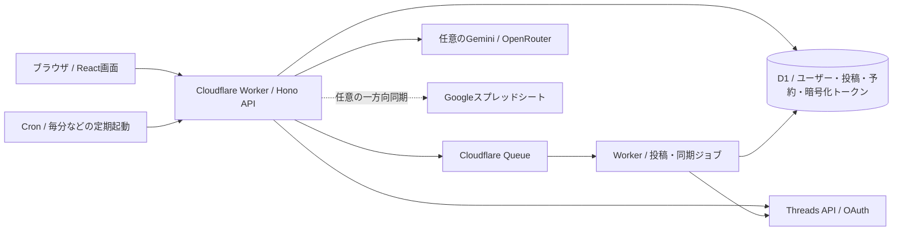

# Threads Autopilot — 構成・Meta審査・運用ナレッジ

更新：2026-09-08。現在の実装・実画面で確認した状態を優先する。過去の進行ログにある「未提出」「ステージングは一切投稿不可」は、以下の状態で更新されている。

## 現在の結論

- Metaアプリレビューは2026-09-08 19:38 JSTに「審査中」を確認。**承認済みではない**。Meta画面の案内は20日以内、追加確認で延長の可能性。
- 生徒3人・Threads5アカウントの先行利用はステージングで実施。本番とはWorker・D1・Queue・認証情報が別。
- 手動の「今すぐ投稿」と日時指定の予約投稿を対象者だけに許可。ステージングでもThreadsには実際に公開される。
- 生徒向けの自動生成・自動投稿（Autopilot）の定期実行とメール送信は有効化していない。
- 3人には今回新規発行した招待キーを1つずつ渡す。過去の招待キーでは今回の投稿許可が付かない。

## 3種類の認証を混同しない

| 種類 | 用途 | 扱い |
|---|---|---|
| アプリのアクセスキー／招待キー | メール・パスワードによるアプリ初回登録 | 1キー1人、初回登録で消費。Threadsトークンではない |
| Threads OAuth「Threadsで接続する」 | 本人のThreadsアクセスを許可し、トークンをサーバーで取得 | 運営のMetaアプリを利用。審査前は対象者のテスター招待と承認が必要 |
| Threadsアクセストークン直接入力 | すでに本人が取得済みのトークンで接続 | 必要な権限と有効期限が必要。審査や発行元アプリの制限を回避する手段ではない |

APIキーを持っているだけで、他人のアカウントを操作できるわけではない。投稿には対象アカウントに紐づく有効なThreadsトークンと、投稿に必要な権限が必要。生徒が自分のMetaアプリで発行したトークンも入力経路は利用できるが、発行元アプリ側の権限・テスター条件は本人が満たす必要がある。

## 生徒に渡す手順

1. 自分のThreadsで、運営から届いたThreadsテスター招待を承認する。Meta管理画面では指定5件とも承認待ちを確認済み。招待の送付はオーナーが実施。
2. `https://threads-autopilot-staging.yama-threads-apps.workers.dev` を開く。
3. 新規登録画面で、本人のメール・本人が決めたパスワード・割り当てられた招待キーを入力する。
4. 設定から「Threadsで接続する」。Threads側に複数ログインしている場合、選択中のアカウントを必ず確認する。本人のトークンを持っていれば直接入力も可能。
5. 次の5アカウントのうち、自分が管理するものだけを接続する。複数アカウントを1つのアプリログインで管理できる。3人と5アカウントの対応を事前に固定せず、最初の正当な接続で所有者を固定する。
6. 同期後、下書き保存→本文と投稿先を確認→「今すぐ投稿」または日時予約。予約時刻は画面のタイムゾーンを確認する。

対象：`yonashi_kahannshinyase` / `lions.study` / `hikkoshi_makasete` / `shiga_lunch_bakery` / `noricha.pht`。

キー一覧はGit・ナレッジ・公開サイトに入れない。オーナー用のローカル配布ファイルから、各本人へ1つずつ渡す。3キー全部を生徒全員に共有しない。

## ジュニア向けアーキテクチャ

- **画面**：`web/`。React・TypeScript・Vite、TanStack Query。ブラウザは主に入力・表示を担当する。
- **APIとバックグラウンド処理**：`worker/`。HonoのAPI、認証、Threads連携、同期、投稿の状態遷移を担当する。
- **共有定義**：`shared/`。画面とWorkerが同じ型や入力ルールを参照する。
- **データベース**：D1（SQLite系）。ユーザー、ログインセッション、アカウント、投稿と指標、下書き・予約、ジョブ、ライセンスなどの正本。ORMを使わない薄いSQLラッパ。
- **スプシ**：実装はあるが正本ではなく閲覧・集計用の任意の一方向同期。現ステージングはGoogle OAuth client IDが空で、連携有効化は別作業。
- **予約**：D1に予約を保存→Cronが期限到来を検出→Queueがジョブを運ぶ→WorkerがThreadsへ送る。ブラウザを閉じてもサーバー側で動く。
- **ツリー**：ルート投稿の作成・公開後、本人の続き投稿を返信として順次作る。非同期なので数分かかることがある。
- **Autopilot**：手動の下書き・予約とは別の生成／承認／計画処理。生徒ベータでは自動で投稿が増える機能を今回の許可に含めない。

## 環境とデプロイ

| 環境 | Worker / URL | 設定 |
|---|---|---|
| ローカル | Vite / Wrangler dev | `wrangler.toml`、ローカルD1 |
| ステージング | `threads-autopilot-staging.yama-threads-apps.workers.dev` | `wrangler.staging.toml` |
| 本番 | Worker名 `threads-autopilot` | `wrangler.production.toml` |

ステージングD1：`dcce5294-b2de-4c72-9a81-5dc6f6d2e00a`。本番D1：`89935cef-db44-49c9-b0aa-50cc8105a786`。Cloudflareアカウント：`983c65a0c3fccb8c1a40ac8ca7e8c3d4`。

今回のステージング配布版：`d1ce68d0-4dec-4692-89f8-178212a725f3`。本番へは今回デプロイしていない。

通常手順：型検査・関連テスト→Web build→`check:staging`→ステージングD1の必要な移行→`deploy:staging`→ヘルス・権限・Cron確認。本番は別の承認範囲と設定で行う。

## 生徒ベータの権限制御

- `STAGING_BETA_PUBLISHING=1` と期限が有効な場合にだけ生徒の許可を評価する。期限は `2026-12-31T23:59:59Z`（日本時間2027-01-01 08:59:59）。延長時は設定を更新する。
- D1の `staging_beta_licenses` に今回の3つのライセンスIDのみを登録。ライセンスが有効であることも毎回確認する。
- `staging_beta_profiles` に5つのユーザー名を登録。トークン/OAuthで取得した `/me` のユーザー名を初回に照合し、数値のThreads IDとアプリ利用者IDを固定する。
- 別のアプリ利用者への付け替え、同じユーザー名を使う別Threads IDは拒否する。本人の改名後は数値IDで同一性を判断する。
- キュー登録・予約変更・今すぐ投稿・投稿ジョブ・Threadsへの書き込み直前に権限を確認する。
- 最終API呼び出し直前にもトークンの本人IDを取得し、ジョブが意図するアカウントと照合する。DELETEや任意の書き込みAPIは許可しない。
- 審査用の既存ログインと @yama_threads.sub の組み合わせは別枠として維持。
- Cronは対象者の手動投稿・予約だけを最大3アカウントずつ処理する。Queueは同時実行数1。時刻ぴったりの秒単位公開は保証しない。
- 失効は対象 `staging_beta_profiles.enabled=0`、ライセンス失効、または全体の `STAGING_BETA_PUBLISHING=0` で止める。プロフィールのID・所有者固定を消す操作は、引き継ぎ先の本人確認後に管理者が行う。

実装入口：`worker/src/lib/staging-beta-policy.ts`、`staging-review-policy.ts`、`review-scheduler.ts`。運用登録SQL：`scripts/sql/staging-student-beta-20260908.sql`。秘密のキー自体はこのSQLに含めない。

## セキュリティと運用上の限界

- トークンはサーバーで暗号化してD1に保存。復号鍵などはCloudflare Secrets。APIを使うときはサーバーが復号するため、運営が絶対に復号できない設計ではない。
- セッション・ライセンス・アカウント所有者でデータアクセスを制御する。環境を分けても外部Threadsの公開先は実アカウントである。
- Geminiは課金有効なキーについての申告とデータ送信同意が必要。地域固定はない。OpenRouterは実装上Bedrock US経路、フォールバック禁止などの制約を置いている。
- APIキー・パスワード・招待キー・個人書類をGit、スクリーン録画、エラーログへ出さない。
- ステージングではメール送信が停止している。パスワードを忘れた場合、メールによる通常のリセットは利用できないためオーナー対応が必要。
- ステージングのCronは限定投稿用であり、本番の全定期処理を同じように動かしてはいない。分析は「今すぐ同期」を利用。長期の連続運用前にトークン定期更新・分析定期同期の別途検証が必要。トークン失効時は再接続する。
- D1を使うこと自体は、データ消失ゼロや1000人での性能を保証しない。障害復旧はDBバックアップだけでなく復号鍵などの別保管と復元検証も必要。1000人規模は同期頻度・投稿量・API/DB予算・実負荷を測ってから判断する。
- 無料プラン設定を維持。AI APIなど外部サービスの費用まで無料になるわけではない。

## Metaアプリレビューの構成

- Meta App ID：`1584346690092191`。Threads OAuth App ID：`924086796982144`。これらを混同しない。
- Business：`yama_skill`、ID `608992394964510`。個人事業主として事業者認証を実施した。
- 申請ID：`1584686080058252`。
- 申請権限：`threads_basic`、`threads_manage_insights`、`threads_content_publish`、`threads_manage_replies`、`threads_read_replies`。
- OAuthの戻り先はステージングと本番の両方を完全一致で登録する。アンインストール・削除通知などのURLは実装済みの専用エンドポイントを使い、適当なトップページを入れない。詳細は `docs/meta-callbacks.md`。
- 審査用は専用のアプリログインを渡し、通常ログインやThreadsのパスワードを共有しない。
- 事業者認証、アクセス認証、アプリレビュー、アプリ公開は別の状態。アプリレビューが審査中だから一般利用者のOAuthが承認済みとは限らない。

### 実施した検証と動画

録画：`Screen Recording 2026-09-08 at 13.38.12.mov`、17分49秒・音声なし。実アプリの分析→Threads再認証→下書き→手動公開→Threads上のルートと続きの表示を記録。5つの権限それぞれの動画欄で添付リンクを確認した。審査用ログイン情報の添付も維持。

録画内のルート：`https://www.threads.com/@yama_threads.sub/post/DdA3JYJFLWX`。続き：`https://www.threads.com/@yama_threads.sub/post/DdA3e37G8uY`。

別途の日時予約テストは13:15:58 JSTに公開を確認：`https://www.threads.com/@yama_threads.sub/post/DdAzmPyG3Ts`。テスト中だけ審査用アカウントの投稿間隔を一時短縮し、終了後に元へ戻した。

Graph API Explorerでもプロフィール・インサイト・返信取得、ルート／返信コンテナ作成を確認。Explorerで作った追加コンテナは公開していない。テスト完了表示のために余分な公開投稿は不要だった。

### 今回の教訓

1. APIのHTTP成功、Metaのテスト実績の反映、用途フォームの保存、最終申請の受理は別々に確認する。
2. テストを実行しても審査画面はしばらく0/1だった。後で5権限すべて「完了」を確認。画面は最大24時間の反映遅延を案内していた。
3. 権限カードが「編集」に変わっただけでは提出可能と断定しない。実際の提出ボタンと最終送信後の「審査中」を見る。
4. 予約が動かない原因には投稿間隔ガードもある。Cron未起動、Queue未配送、投稿間隔違反、トークンエラーを区別してログを見る。
5. ツリー公開とURL同期は非同期。公開直後に一覧が古ければ再読込し、同じ投稿を再送しない。
6. Googleの処理国は公開拠点から推定した50か国・地域。ユーザー承認のもと、正式欄の名称と説明に未確認の推定と明記して提出した。Google確認済みの全処理国リストや、日本限定の保証として再利用しない。
7. Google問い合わせメールは送信操作を試したが、送信済みの確認ができていない。返信待ちとして扱わない。
8. ブラウザ操作中に利用者が別画面へ切り替えると、入力が保存されないことがある。画面を取り直して値と保存状態を再検証する。
9. Cloudflare CLIで一時的にD1権限エラー7403が出た。対象アカウント・権限・D1一覧を確認後の再実行は成功。原因を恒久的な権限不足と断定しない。

### 一次情報・追加資料

- Meta公式Threads APIコレクション：https://www.postman.com/meta/threads/documentation/dht3nzz/threads-api
- Gemini規約：https://ai.google.dev/gemini-api/terms
- Googleデータ処理契約：https://business.safety.google/processorterms/
- Google公開拠点：https://about.google/company-info/locations/
- Googleデータセンター：https://datacenters.google/locations/
- 個別の実装・画面・録画手順は `docs/meta-reviewer-runbook.md`、`docs/meta-recording-guide.md`、`docs/ai-routing-policy.md`、`docs/production-security.md` を参照。古い状態記述は本書の最新確認を優先する。

## 今回の検証結果

- 型検査とWebビルド成功。
- 限定投稿・既存ステージング・審査用投稿：31テスト成功。
- Shared：91テスト成功。Worker既存を含む538テスト成功後、運用SQLの配置を修正して失敗していたコールバック14テストも成功。
- リモートD1：許可5プロフィール、指定ライセンス3つ、未使用キー3つ、初回接続はまだ0件を確認。
- 配布後のHTTP確認：ヘルス200、通常オーナーの投稿不可、審査専用ログインの投稿可を確認。
- 生徒本人の接続・実投稿は未実施。招待承認・本人登録・接続後に、生徒自身が本文と投稿先を確認して実行する。
